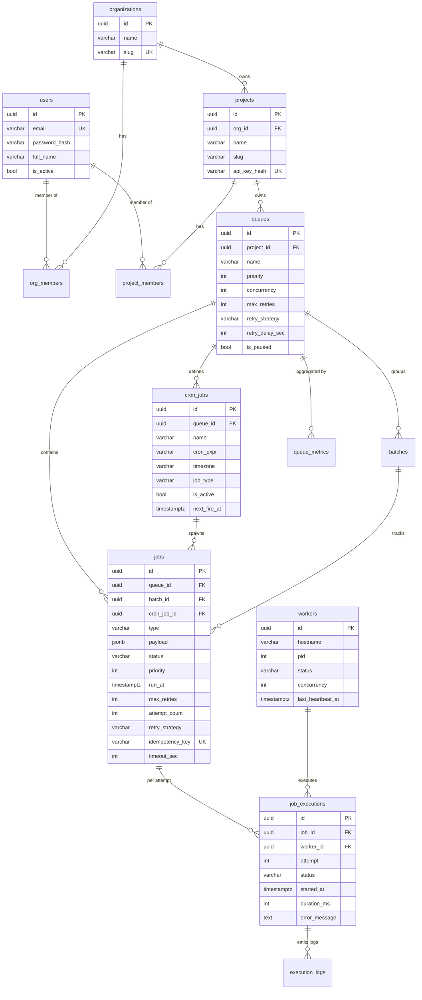

# Distributed Job Scheduler

A backend-focused distributed job scheduling system built in Go, with a PostgreSQL queue backend and a React/Next.js admin dashboard. Runs fully locally via Docker Compose.

---

## Table of Contents

- [Overview](#overview)
- [Tech Stack](#tech-stack)
- [Architecture](#architecture)
- [Database Schema (ER Diagram)](#database-schema-er-diagram)
- [Features](#features)
- [Project Structure](#project-structure)
- [Running Locally](#running-locally)
- [API Endpoints](#api-endpoints)
- [Design Decisions](#design-decisions)

---

## Overview

This is a distributed background job processing system. Jobs are enqueued via a REST API, stored in PostgreSQL, and claimed and executed by a pool of concurrent worker processes. Multiple worker nodes can run simultaneously without duplicate job execution, thanks to PostgreSQL's `SELECT ... FOR UPDATE SKIP LOCKED`.

The system supports:
- Immediate, delayed (scheduled), and recurring (cron) jobs
- Batch job tracking
- Configurable retry strategies with backoff
- Dead letter queue for failed jobs
- Real-time dashboard with WebSocket-based live metrics

---

## Tech Stack

| Layer | Technology |
|---|---|
| API Server | Go, [Fiber](https://gofiber.io/) |
| Worker | Go (goroutines, concurrent pool) |
| Database | PostgreSQL (pgx v5, golang-migrate) |
| Cache & Pub/Sub | Redis |
| Dashboard | Next.js 16, React, TanStack Query, Zustand |
| Containerization | Docker, Docker Compose |

---

## Architecture

```
┌─────────────────────────────────────────────────────────────┐
│                        Clients                              │
│           (Dashboard UI  /  Direct API calls)               │
└─────────────────────┬───────────────────────────────────────┘
                      │ HTTP REST
                      ▼
┌─────────────────────────────────────────────────────────────┐
│                    Go API Server (:8080)                    │
│  • Auth (JWT + refresh tokens)                              │
│  • Org / Project / Queue / Job CRUD                         │
│  • Cron & Batch management                                  │
│  • WebSocket hub (live metrics via Redis Pub/Sub)           │
│  • Rate limiting (100 req/min per IP, via Redis)            │
└──────────────┬─────────────────────────┬────────────────────┘
               │ Read/Write              │ Pub/Sub
               ▼                         ▼
┌─────────────────────┐     ┌──────────────────────┐
│     PostgreSQL      │     │        Redis         │
│  (jobs, queues,     │     │  (rate limit, WS     │
│   workers, logs,    │     │   events, dist lock) │
│   cron, metrics)    │     └──────────────────────┘
└────────┬────────────┘
         │ SELECT FOR UPDATE SKIP LOCKED
         ▼
┌─────────────────────────────────────────────────────────────┐
│                   Go Worker Node(s)                         │
│  • Poll DB every N ms for pending jobs                      │
│  • Claim jobs atomically (no duplicate execution)           │
│  • Execute handler in goroutine with per-job timeout        │
│  • On success  → mark succeeded                             │
│  • On failure  → schedule retry or move to dead             │
│  • Heartbeat every 5s to mark worker as alive               │
│  • Graceful shutdown on SIGTERM (drains active jobs)        │
└─────────────────────────────────────────────────────────────┘
```

---

## Database Schema (ER Diagram)



---

## Features

### Job Lifecycle
```
pending → running → succeeded
                  ↘ failed → (retry) → scheduled → pending → ...
                                     ↘ dead (DLQ after max retries)
cancelled (user-triggered at any pre-running stage)
```

### Retry Strategies
Configured per-queue or overridden per-job:
| Strategy | Behavior |
|---|---|
| `fixed` | Constant delay (e.g. always retry after 60s) |
| `linear` | Delay grows: `attempt * base_delay` |
| `exponential` | Delay doubles: `2^(attempt-1) * base_delay`, with optional ±25% jitter |

### Authentication & RBAC
- JWT access tokens (15 min expiry) + refresh tokens (7 days)
- **Organization roles:** `owner`, `admin`, `member`
- **Project roles:** `admin`, `developer`, `viewer`

### Worker Reliability
- `SELECT ... FOR UPDATE SKIP LOCKED` — multiple workers poll simultaneously with zero contention
- Per-job execution timeouts (configurable via `timeout_sec`)
- Heartbeat loop (5s interval) marks workers alive; the reaper reclaims jobs from dead workers
- Graceful shutdown: catches `SIGTERM`, stops accepting new jobs, waits for active goroutines

---

## Project Structure

```
.
├── backend/
│   ├── cmd/
│   │   ├── api/main.go          # API server entrypoint
│   │   └── worker/main.go       # Worker entrypoint
│   ├── internal/
│   │   ├── domain/              # Domain models and repository interfaces
│   │   │   ├── job/
│   │   │   ├── queue/
│   │   │   ├── org/
│   │   │   ├── project/
│   │   │   ├── cron/
│   │   │   ├── batch/
│   │   │   ├── worker/
│   │   │   ├── metrics/
│   │   │   └── execlog/
│   │   ├── handler/             # HTTP handlers (Fiber)
│   │   ├── middleware/          # Auth, RBAC middleware
│   │   ├── repository/postgres/ # PostgreSQL implementations
│   │   ├── service/             # Business logic layer
│   │   ├── worker/              # Worker components
│   │   │   ├── dispatcher.go    # Polls DB, claims jobs
│   │   │   ├── executor.go      # Runs handler, handles retries
│   │   │   ├── pool.go          # Goroutine concurrency pool
│   │   │   ├── reaper.go        # Reclaims stale running jobs
│   │   │   ├── scheduler.go     # Promotes scheduled→pending
│   │   │   ├── cron.go          # Fires cron job definitions
│   │   │   └── heartbeater.go   # Sends worker heartbeats
│   │   ├── platform/            # DB, logger, Redis, errors
│   │   └── config/              # Config loading
│   ├── migrations/              # SQL migration files
│   └── pkg/
│       ├── retry/               # Backoff strategy implementation
│       ├── lock/                # Redis distributed lock
│       └── validator/           # Request validation
├── frontend/                    # Next.js dashboard
├── docker-compose.yml
├── .env.example
└── docs/
    ├── architecture.md
    ├── er_diagram.md
    ├── api.md
    └── design_decisions.md
```

---

## Running Locally

**Prerequisites:** Docker and Docker Compose installed.

```bash
# 1. Clone
git clone https://github.com/VermaVanshdeep/codity_assignment.git
cd codity_assignment

# 2. Copy environment variables (defaults work out of the box)
cp .env.example .env

# 3. Start all services
docker compose up --build -d
# Starts: PostgreSQL, Redis, Go API (:8080), Go Worker, Next.js Dashboard (:3000)

# 4. Seed test data (admin user, org, project, queue, 500 mock jobs)
python3 seed.py
```


## API Endpoints

All endpoints (except auth) require `Authorization: Bearer <token>`.

```
POST   /api/v1/auth/login
POST   /api/v1/auth/register
POST   /api/v1/auth/refresh

GET    /api/v1/orgs
POST   /api/v1/orgs
GET    /api/v1/orgs/:orgId
PATCH  /api/v1/orgs/:orgId

GET    /api/v1/orgs/:orgId/projects
POST   /api/v1/orgs/:orgId/projects

GET    /api/v1/projects/:projectId/queues
POST   /api/v1/projects/:projectId/queues
PATCH  /api/v1/projects/:projectId/queues/:queueId
POST   /api/v1/projects/:projectId/queues/:queueId/pause
POST   /api/v1/projects/:projectId/queues/:queueId/resume

GET    /api/v1/projects/:projectId/queues/:queueId/jobs
POST   /api/v1/projects/:projectId/queues/:queueId/jobs
GET    /api/v1/projects/:projectId/queues/:queueId/jobs/:jobId
DELETE /api/v1/projects/:projectId/queues/:queueId/jobs/:jobId

GET    /api/v1/projects/:projectId/queues/:queueId/cron
POST   /api/v1/projects/:projectId/queues/:queueId/cron

GET    /api/v1/metrics/system
GET    /api/v1/metrics/queues/:queueId

GET    /api/v1/health
WS     /api/v1/ws    (real-time events)
```

---

## Design Decisions

**PostgreSQL as the job queue broker (not Kafka/RabbitMQ)**
Using `SELECT ... FOR UPDATE SKIP LOCKED` keeps the stack simple — no extra broker to operate. Transactional guarantees are stronger (a job exists iff the enqueue transaction committed). The trade-off is lower raw throughput vs. an in-memory broker, mitigated by partial indices on `(queue_id, priority, run_at) WHERE status IN ('pending', 'scheduled')`.

**Exponential backoff with jitter**
Without jitter, all failing jobs would retry at the exact same time after an outage, creating a thundering herd. Adding ±25% randomized jitter distributes the retry load. Fixed and linear strategies are also available for predictability-critical jobs.

**Dead Letter Queue as a status, not a separate table**
Dead jobs are kept in the `jobs` table with `status = dead`. This avoids schema duplication and keeps full job history (payload, attempts, errors) in one place for inspection and manual re-queuing.

**Worker heartbeats + reaper**
Workers write a heartbeat every 5 seconds. A reaper goroutine periodically scans for workers whose last heartbeat exceeds a threshold and reclaims their `running` jobs back to `pending`. This handles hard crashes (OOM, kill -9) without manual intervention.
