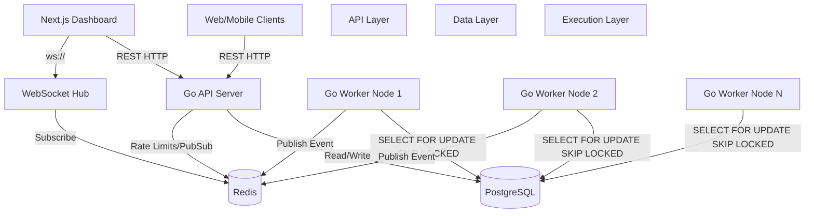

# System Architecture

The distributed job scheduler follows a decoupled architecture, separating the API server from the execution workers, connected via a robust PostgreSQL database acting as the queue broker.

## Flow Overview

1. **Enqueue:** Clients hit the API to create jobs. The API inserts the job into the PostgreSQL `jobs` table with `status = pending`.
2. **Claim:** Worker nodes continuously poll the database using `SELECT ... FOR UPDATE SKIP LOCKED`. This guarantees that a job is atomically claimed by exactly one worker without table-locking contention.
3. **Execute & Transition:** The worker executes the job in a goroutine. On success, it updates the job to `succeeded`. On failure, the executor checks the `retry_strategy` (Fixed, Linear, Exponential) and updates the job to `scheduled` with a future `run_at` timestamp. If retries are exhausted, it moves to `dead`.
4. **Real-time Metrics:** Workers publish execution events (success, failure, heartbeat) to Redis Pub/Sub. The WebSocket Hub subscribes to Redis and pushes these live updates to the connected Next.js Dashboard.
