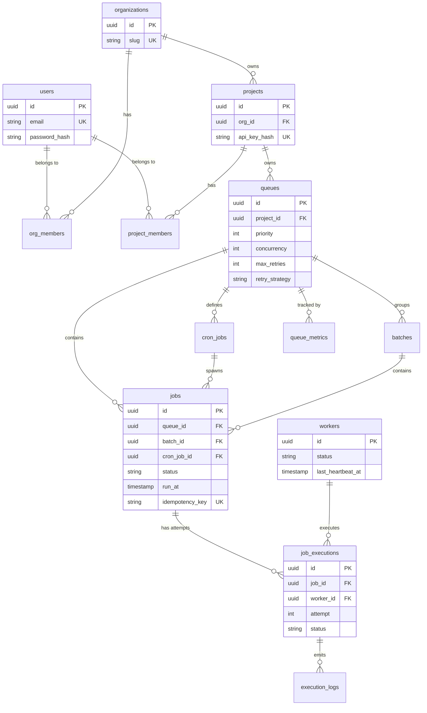

# Entity-Relationship (ER) Diagram

The system employs a heavily normalized relational schema with strict foreign key constraints and optimized partial indices for high-throughput queue operations.

